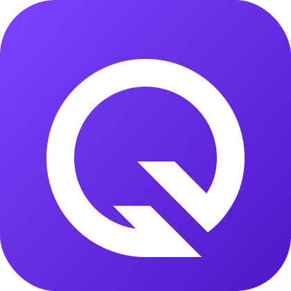

<a id="readme-top"></a>

[![Contributors][contributors-shield]][contributors-url]
[![Forks][forks-shield]][forks-url]
[![Stargazers][stars-shield]][stars-url]
[![Issues][issues-shield]][issues-url]
[![MIT License][license-shield]][license-url]
[![LinkedIn][linkedin-shield]][linkedin-url]


<br />
<div align="center">
  <a href="https://github.com/oliveira-mark/landing-page-quiz-product-recommendation">
    
  </a>

  <h3 align="center">Quiz Product Recommendation</h3>

  <p align="center">
    A digital Personal Shopper that does the selling for you!
    <br />
    <a href="https://bymarcos.com/landing-page-quiz-product-recommendation/">View Demo</a>
    ·
    <a href="https://github.com/oliveira-mark/landing-page-quiz-product-recommendation/issues/new?labels=bug&template=bug-report---.md">Report Bug</a>
    ·
    <a href="https://github.com/oliveira-mark/landing-page-quiz-product-recommendation/issues/new?labels=enhancement&template=feature-request---.md">Request Feature</a>
  </p>
</div>


## About The Project

[![Weather App Screenshot][product-screenshot]](https://bymarcos.com/weather/)

Sales With QuizCommerce guides your customers throughout their shopping experience and helps them find the right products for them.

<p align="right">(<a href="#readme-top">back to top</a>)</p>


### Built With

This section lists the major frameworks and libraries used to build the project. Add-ons and plugins are typically mentioned in the acknowledgements section. Here are the technologies used in this project:

* [![React][React.js]][React-url]
* [![TypeScript][TypeScript]][TypeScript-url]
* [![Webpack][Webpack]][Webpack-url]
* [![ESLint][ESLint]][ESLint-url]

<p align="right">(<a href="#readme-top">back to top</a>)</p>

## Getting Started

This guide will help you get a local copy of the project up and running. Follow these simple steps to set up the project locally.

### Prerequisites

Make sure you have the following installed before proceeding:

* **Node.js** and **npm** (Node Package Manager)  
  You can download and install Node.js (which includes npm) from [here](https://nodejs.org/).

* **Git**  
  Ensure you have Git installed to clone the repository. You can install Git from [here](https://git-scm.com/).

### Installation

Follow these steps to install and set up the project locally:

1. Clone the repository  
   ```bash
   git clone https://github.com/oliveira-mark/landing-page-quiz-product-recommendation.git

2. Navigate to the project directory  
   ```bash
   cd landing-page-quiz-product-recommendation

3. Install the project dependencies  
   ```bash
   npm install
   ```  
4. Start the development server  
   ```bash
   npm run dev
   ```

## Usage

To use the application, follow these steps:

1. Open the application in your web browser.  
   ```bash
   http://localhost:3000
   ```

<p align="right">(<a href="#readme-top">back to top</a>)</p>


### Top contributors:

<a href="https://github.com/oliveira-mark/landing-page-quiz-product-recommendation/graphs/contributors">
  
</a>

<p align="right">(<a href="#readme-top">back to top</a>)</p>


<!-- LICENSE -->
## License

Distributed under the MIT License. See `LICENSE.txt` for more information.

<p align="right">(<a href="#readme-top">back to top</a>)</p>


<!-- CONTACT -->
## Contact

Marcos Oliveira - [@oliveira-mark](https://linkedin.com/in/oliveira-mark/) - hello@bymarcos.com

Project Link: [https://github.com/oliveira-mark/landing-page-quiz-product-recommendation](https://github.com/oliveira-mark/landing-page-quiz-product-recommendation)

<p align="right">(<a href="#readme-top">back to top</a>)</p>


<!-- ACKNOWLEDGMENTS -->
## Acknowledgments

Here are a few resources that were essential for this project:

* [Choose an Open Source License](https://choosealicense.com) - To help you choose an open-source license for your project.
* [Tailwind CSS](https://tailwindcss.com) - A utility-first CSS framework used for styling the application.
* [ESLint](https://eslint.org/) - For maintaining code quality and ensuring best practices.

<p align="right">(<a href="#readme-top">back to top</a>)</p>


[contributors-shield]: https://img.shields.io/github/contributors/oliveira-mark/landing-page-quiz-product-recommendation.svg?style=for-the-badge
[contributors-url]: https://github.com/oliveira-mark/landing-page-quiz-product-recommendation/graphs/contributors
[forks-shield]: https://img.shields.io/github/forks/oliveira-mark/landing-page-quiz-product-recommendation.svg?style=for-the-badge
[forks-url]: https://github.com/oliveira-mark/landing-page-quiz-product-recommendation/network/members
[stars-shield]: https://img.shields.io/github/stars/oliveira-mark/landing-page-quiz-product-recommendation.svg?style=for-the-badge
[stars-url]: https://github.com/oliveira-mark/landing-page-quiz-product-recommendation/stargazers
[issues-shield]: https://img.shields.io/github/issues/oliveira-mark/landing-page-quiz-product-recommendation.svg?style=for-the-badge
[issues-url]: https://github.com/oliveira-mark/landing-page-quiz-product-recommendation/issues
[license-shield]: https://img.shields.io/github/license/oliveira-mark/landing-page-quiz-product-recommendation.svg?style=for-the-badge
[license-url]: https://github.com/oliveira-mark/landing-page-quiz-product-recommendation/blob/master/LICENSE.txt
[linkedin-shield]: https://img.shields.io/badge/-LinkedIn-black.svg?style=for-the-badge&logo=linkedin&colorB=555
[linkedin-url]: https://linkedin.com/in/oliveira-mark/
[product-screenshot]: public/assets/img/screenshot.png
[React.js]: https://img.shields.io/badge/React-20232A?style=for-the-badge&logo=react&logoColor=61DAFB
[React-url]: https://reactjs.org/
[TypeScript]: https://img.shields.io/badge/TypeScript-3178C6?style=for-the-badge&logo=typescript&logoColor=white
[TypeScript-url]: https://www.typescriptlang.org/
[Webpack]: https://img.shields.io/badge/Webpack-8DD6F9?style=for-the-badge&logo=webpack&logoColor=black
[Webpack-url]: https://webpack.js.org/
[ESLint]: https://img.shields.io/badge/ESLint-4B32C3?style=for-the-badge&logo=eslint&logoColor=white
[ESLint-url]: https://eslint.org/
[Tailwind CSS]: https://img.shields.io/badge/Tailwind_CSS-grey?style=for-the-badge&logo=tailwind-css&logoColor=38B2AC
[Tailwind-url]: https://tailwindcss.com/